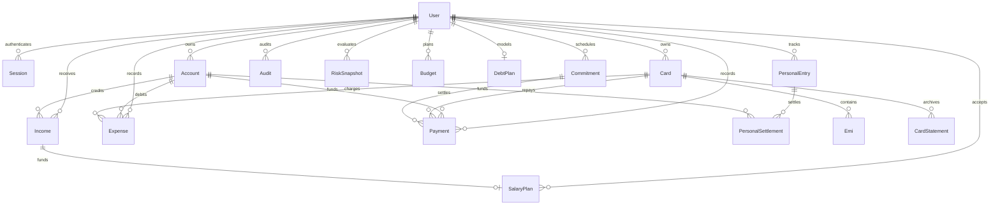

# MoneyPath architecture and delivery plan

## Boundaries

Phase 1 is a single-owner Next.js App Router application with TypeScript, Tailwind, Recharts, PostgreSQL and Prisma. A pure finance module owns calculations in integer paise. Route handlers own validation and authentication; a transactional service owns all cash and liability mutations. The UI consumes a calculated snapshot, never calculates authoritative balances. AI, bank import, notifications and mobile clients can later consume the same service API. No AI participates in accounting.

## Entity relationships

Amounts are integer paise (bounded below JavaScript's safe integer limit and PostgreSQL Int limit). Dates are calendar dates interpreted in Asia/Kolkata; stored at UTC midnight. Initial balances and liabilities are explicit opening snapshots. Never enter historical transactions already included in opening balances. Nullable financial inputs remain unknown until supplied; zero is a deliberate value.

## Calculation contract

- Safe to spend = spendable bank/cash balances minus unfunded obligations through the next salary date (inclusive), essential living reserve, emergency reserve, extra debt allocation and goal reserve. Clamp displayed availability to zero and expose the negative result as a separate shortfall. Expected salary/receivables and credit limits are excluded.
- Emergency and goal reserves are earmarks within spendable accounts. Accounts marked non-spendable are excluded already; do not earmark their balances again.
- Monthly reserve = ceiling(amount / frequency in months). Long-cycle commitments reserve the larger of one monthly accrual and the remaining funding divided by months to due date. A commitment due within the horizon reserves its full unpaid amount. These are alternatives, never added together for the same obligation. Funded reserves are earmarked cash and stay deducted until paid.
- Statement remaining = max(0, statement amount - paid against statement). Current outstanding includes posted statement and unbilled charges, excludes unbilled EMI principal. Unbilled = outstanding - statement remaining; inconsistent negative results require reconciliation.
- A new statement archives the previous statement. Its unpaid balance carries forward with the earlier due date, is included in the new statement total, and is reserved separately from the rest of the new bill without duplication. Statement payments clear carried balances first. Rollover changes neither total debt nor expenses.
- Total card debt = posted outstanding + unbilled EMI principal. Each EMI has explicit next principal and interest components; posting an installment moves principal into posted outstanding and records only interest as a new expense. Paying a card reduces bank cash and posted debt once; it never creates an expense.
- Card payment allocation must distinguish statement and unbilled payments. Reject overpayments, insufficient funds and payments beyond remaining statement. Commitment payments reduce cash and create an expense once, except savings/investment contributions which are transfers.
- Next salary uses editable salary day, clamped to month end. Calendar and obligation horizon include overdue payments. Recurrences advance from the original day with month-end clamping; custom frequency uses an explicit month interval.
- Budget variance = budget - actual; zero budget with spend has no finite percentage. Net debt reduction = debt payments - new debt (including interest). Goal shortfall excludes expected funds.

## Basic deterministic risk v1

Clamp sum to 0–100. 0–30 Low, 31–50 Moderate, 51–70 High, 71–100 Critical (the brief's illustrative 72/High conflicts with these thresholds; thresholds win).

Rules: debt > monthly income +15; new card spending with old bill +15; utilization >50% +10 (>80% +20 instead); overdue +20; mandatory/monthly income >60% +10; emergency reserve below essential reserve +10; negative safe-to-spend +15 (else below ₹3,000 +5). Missing inputs produce Information Required rather than a low-risk score. Store version, score and triggered reasons when financial data changes. Advanced budget/debt-trend/savings rules belong to Phase 2 when those histories exist.

## Pages and API

Pages: dashboard, income, accounts, commitments, expenses, credit cards, EMI, payments, calendar, settings; local login and initial owner setup. Responsive sidebar collapses on mobile. Shared fast-entry form with server validation, clear errors and success feedback.

`POST /api/auth`: first-owner registration, login, logout. Database sessions with random hashed tokens, scrypt password hashing, HttpOnly SameSite cookies, fixed expiry, persisted login throttling. All mutations validate Origin. Owner registration uses a deployment setup token and is serialized.

`GET /api/snapshot`: authenticated owner-scoped data and calculated dashboard. `POST /api/records`: validated commands (account, income, expense, card, commitment, EMI, payment, settings, statement rollover, installment posting). Serializable transactions, idempotency keys and ownership checks prevent double application. `GET /api/export`: authenticated CSV Phase 1 export. No destructive editing of posted transactions; record corrections through explicit reversal tooling in a future phase. Editable settings and commitment/card metadata are supported without rewriting ledger history.

Sensitive free text and optional card last four are encrypted with AES-256-GCM using an external environment key. No full card numbers, CVV, PIN, OTP or bank credentials have fields. Audit stores action/entity identifiers, not plaintext private notes.

## Delivery phases

Current status: Phases 1 and 2 implemented; Phase 3 personal balances and principal settlements implemented, with remaining scope in [PHASE3.md](PHASE3.md). Phase 4 is pending. See [PHASE2.md](PHASE2.md) for planning contracts, risk v2 rules and model assumptions. Budget, salary-plan, debt-plan and priority-cost writes use the authenticated, audited, idempotent records API. Salary acceptance also validates a source-data fingerprint in a serializable transaction. Budget limits are monthly tracking targets, not additional cash reservations; missing budgets remain unknown. Risk snapshots retain versioned rules and, for new snapshots, tracked cash/debt/assets/net worth.

1. **Foundation and Phase 1:** architecture, schema, deterministic calculations/tests, local auth, accounts/income/commitments/expenses/cards/EMI/payments, dashboard, calendar, basic risk, Docker, operational README. Validate transaction accounting and responsive UI.
2. **Planning:** budgets, spending analysis, salary allocation acceptance, payment priority, purchase simulation, debt payoff forecasts, notification rules, richer history reports.
3. **Goals and assets:** investments, receivables, personal loans, marriage goals, what-if scenarios, Excel export and managed restore UI.
4. **Integrations:** statement import, background notifications, read-only AI explanations, mobile API consumers.

Phase 1 must pass calculation and transaction tests before further features. Database backup/restore is provided as an operator workflow; no upload-and-execute restore endpoint.
